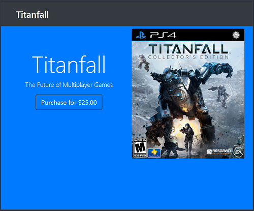

# Node Stripe: Purchase Game
This project is the result of my code-along at the end of the video series [Node.js & Stripe API - Ebook Sales App & Heroku Deploy](https://www.youtube.com/watch?v=QT3_zT97_1g) by *Brad Traversy*.  His original code repo may be found [here](https://github.com/bradtraversy/ebookseller).

<p align="center">
    <br>
</p>

## Versions Used
* Body-Parser v1.18.2
* Express v4.16.2
* Express-Handlebars v3.0.0
* Stripe v5.4.0

## Installing the Project
To begin working with this project, perform the following tasks:

1. Clone this repo: `git clone https://github.com/Stanza987/node-stripe-game.git`
1. `cd` into the folder of the cloned repo
1. Run `yarn install` to install dependencies
1. Add your stripe keys to a new file `config/keys_dev.js`

    ````
    module.exports = {
      stripePublishableKey:'_YOUR_OWN_PUBLISHABLE_KEY_',
      stripeSecretKey:'_YOUR_OWN_SECRET_KEY_'
    }
    ````
    
1. Run `node app.js`
